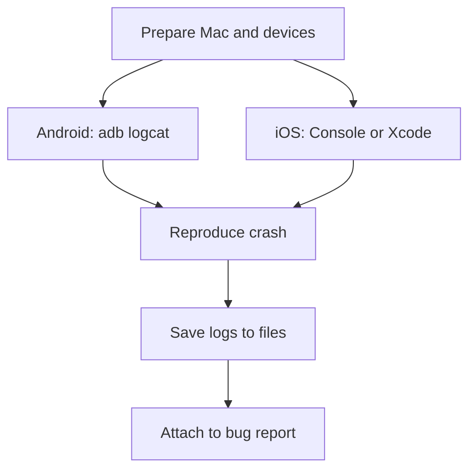

# Manual crash log collection (Mac + Android + iPhone)

Guide for collecting crash logs when a mobile app opens briefly and then closes (cold-start crash), so you can attach them to a bug report.

## When to use this

The app launches, flashes a screen (or splash), then returns to the home screen. Capture logs **before** rebooting the device or clearing log buffers.

## Quick start

| Step | Doc / script |
|------|----------------|
| 1. Set up Mac and both phones | [checklists/01-setup.md](checklists/01-setup.md) |
| 2. Capture Android crash | [02-android.md](02-android.md) · [`scripts/crash-logs/capture-android-crash.sh`](../../scripts/crash-logs/capture-android-crash.sh) |
| 3. Capture iPhone crash | [03-ios.md](03-ios.md) · [`scripts/crash-logs/ios-capture-checklist.sh`](../../scripts/crash-logs/ios-capture-checklist.sh) |
| 4. File the bug report | [templates/bug-report.md](templates/bug-report.md) · [example](templates/bug-report-example.md) |

Related: [04-common-causes.md](04-common-causes.md) (triage context only).

## Minimal tool set

| Platform | Tool | Output |
|----------|------|--------|
| Android | `adb logcat` | Text stack trace |
| Android | Android Studio Logcat | UI filters / export |
| Android | `adb bugreport` | Full ZIP system report |
| iOS | Console.app | Live system log |
| iOS | Xcode → Devices | `.ips` crash reports |
| iOS | Settings → Analytics | Crash files on device |

## Order of work on day one

1. Ask the team for **package name / bundle id** and where to install the build (TestFlight, Firebase App Distribution, APK).
2. Set up Mac (Xcode, `adb`) and enable developer mode on both phones.
3. Capture Android first — `adb logcat` usually yields a stack trace in a couple of minutes.
4. Capture iPhone — Console.app live log plus export `.ips` from Xcode Device Logs.
5. Reproduce the crash 2–3 times; save logs with distinct timestamps.
6. Open a ticket with steps, environment, a **minimal stack excerpt**, and full log files as attachments.
